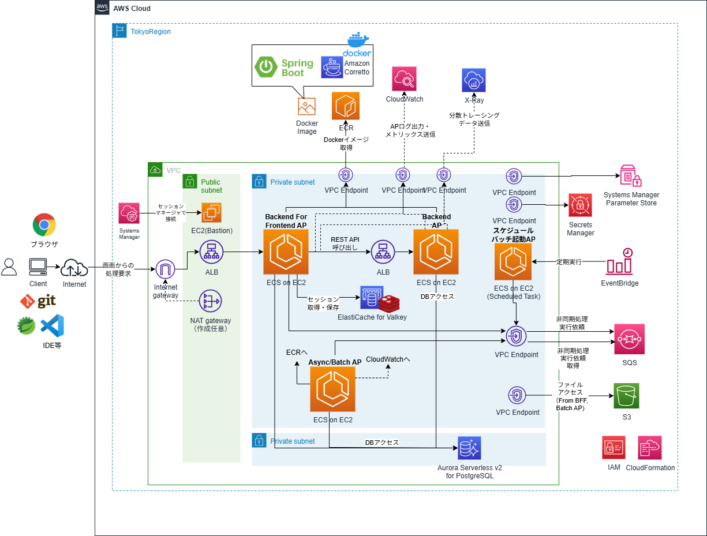
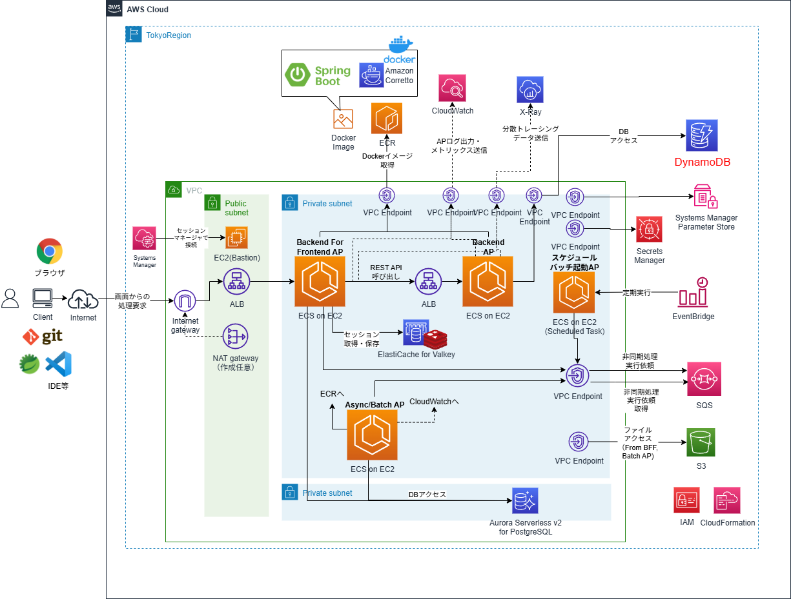
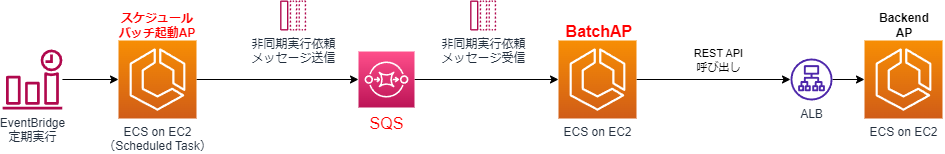

# SpringBoot APをECS/Fargateで動作させCode系でCI/CDするCloudFormationサンプルテンプレート

## 構成
* システム構成図
    * RDB(Aurora Serverless v2 for Postgres)のみ版
        * SpringBootを用いた、BFFアプリケーション、Backendアプリケーション、バッチアプリケーション、スケジュールバッチ起動アプリケーションをECS上に実現した構成が構築される。
            * ECSでリードオンリーコンテナで動作するようにしている
        * 通常は、DBとして、RDB(Aurora Serveless v2 for Postgres)のみを使用した構成となっている。
        * なお、下図はECSからのAPログ転送にCloudWatch Logs（awslogsドライバ）を利用した場合の例記載しているが、後述の通り、FireLens+Fluent Bitによるログ転送にも対応している。           
    

    * DynamoDB併用版
        * BackendアプリケーションをDynamoDBアクセス版のサンプルAPに差し変えることで、ECSからDynamoDBへのアクセスも実現した構成が構築できる。
      

* 処理方式
    * オンラインリアルタイム処理方式
        * BFFアプリケーションからBackendアプリケーションがAPI連携しつつユーザへUIを提供するオンラインリアルタイム処理を実現した構成が構築される
 
    * ディレード処理方式    
        * BFFアプリケーションから、SQSを介したメッセージ連携により、バッチアプリケーションのジョブを非同期で実行するディレード処理にも対応している。
 

    * 純バッチ処理方式    
        * スケジュールイベント（EventBridge）により起動したスケジュールバッチ起動用アプリーションから、SQSを介したメッセージ連携により、バッチアプリケーションのジョブを実行する純バッチ処理にも対応している。 
 


* CI/CD
    * CodePipeline、CodeBuild、CodeDeployを使った、CI/CDに対応。
    * CDは標準のローリングアップデートとBlueGreenデプロイメントの２つのリリース方式に対応している。（バッチAPは、ELB未使用のためローリングアップデートのみ対応）
        * ローリングアップデート


        * BlueGreenデプロメント


> [!WARNING]
>    [2025年7月](https://aws.amazon.com/jp/blogs/news/accelerate-safe-software-releases-with-new-built-in-blue-green-deployments-in-amazon-ecs/)よりECSの組み込みのBlueGreenデプロイメントが利用できるようになったが、本サンプルでは、CodeDeployを使った従来のBlueGreenデプロイメントのままとしている。  
>    今後、対応を検討。

* メトリックスのモニタリング
    * CloudWatch Container Insightsは有効化し、各メトリックスを可視化。

* JVM等のAPメトリクスのCloudWatchメトリクスの転送    
    * Spring Cloud for AWSの機能を使って、Spring Actuatorで取得できるJVM等のAPのメトリクスをCloudWatchメトリクスと統合して転送できるようになっている。

    

* ログの転送
    * awslogsドライバを使ったCloudWatch Logsへのログ転送とFireLens+Fluent Bitによるログ転送に対応。
    * Firelensの場合はFirelensをサイドカーコンテナとして配置する必要がある。


* X-Rayによる分散トレーシング・可視化
    * X-Rayを使ってアプリケーションやAWSサービス間の処理の流れをトレースし、可視化に対応。
    * X-Rayデーモンをサイドカーコンテナとして配置。


    * X-Rayによる可視化
        

* Systems Manager Paramter Store、Secrets Managerの利用
    * APの環境依存パラメータに関してSystems Manager Paramter Store、DBの認証情報に関してSecrets Managerを使って、アプリケーションの設定情報を外部化している。
    * Spring Cloud for AWSの機能を使って、ECSのタスク定義の環境変数に値を設定することなく、直接APが値を取得し、Spring Bootのプロパティ管理と統合された形で利用できるようになっている。    

    


* APのオートスケーリング
    * 平均CPU使用率のターゲット追跡スケーリングポリシーによる例に対応している。


* Auroraのリードレプリカ活用
    * オンライン処理方式のAPについてのDBアクセスのソフトウェアフレームワーク機能と連動し、読み取り専用のトランザクション（Springの@TransactionalのreadOnly属性がtrue）の処理では、動的にDB接続を切り替え、Aurora Serverless v2 for Postgresのリーダーエンドポイントに接続するようになっている。
    * これにより、Auroraのリードレプリカを活用することで、拡張性の高い構成を実現している。

## 事前準備
### S3バケットの作成
* 以下の目的に利用するS3バケットを用意しておく。1つでも、目的ごと別々に３つ用意してもよい。
    * CodePipeline、CodeBuildのArtifact用、キャッシュ用のS3バケット
    * BFFアプリケーション、バッチアプリケーションでファイルを連携するためのS3バケット
    * （FireLensを利用する場合）ログ出力のS3バケット
* 後続の手順で、バケット名を変更するパラメータがあるところで指定する
## CloudFormationのコマンドの実行
* 以降で、AWS CLIのコマンドを使用して、CloudFormationでAWSリソースを作成していく。
* ここでは、aws cloudformation create-stackコマンドを使っているが、deployコマンド等、使う場合は適宜コマンドを読み替えて実行すること
    * 詳細は[（参考）CloudFormationコマンド文法メモ](#参考cloudformationコマンド文法メモ)を参照
## IAM構築
### 1. IAMの作成
* BackendアプリケーションがRDBアクセス版の場合
```sh
aws cloudformation validate-template --template-body file://cfn-iam.yaml
aws cloudformation create-stack --stack-name ECS-IAM-Stack --template-body file://cfn-iam.yaml --capabilities CAPABILITY_IAM
```
* BackendアプリケーションがDynamoDBアクセス版の場合
```sh
aws cloudformation validate-template --template-body file://cfn-iam.yaml
aws cloudformation create-stack --stack-name ECS-IAM-Stack --template-body file://cfn-iam.yaml --capabilities CAPABILITY_IAM --parameters ParameterKey=BackendCodeCommitRepositoryName,ParameterValue=sample-backend-dynamodb
```

* CodePipeline、CodeBuildのArtifact用、キャッシュ用のS3バケット名を変えるには、それぞれのcfnスタック作成時のコマンドでパラメータを指定する
    * 「--parameters ParameterKey=ArtifactS3BucketName,ParameterValue=(バケット名)」
    * 「--parameters ParameterKey=CacheS3Location,ParameterValue=(パス名)」
    
* TBD:　IAMポリシーの記載は精査中

## CI環境構築
### 1. アプリケーションのCodeCommit環境
* 以下のSpringBootAPのプロジェクトを以下のリポジトリ名でCodeCommitに格納する
    * sample-bff
        * BFFのAP
        * Githubに同名の資材があるので、これをCodeCommitに格納する
            * [sample-bff](https://github.com/mysd33/sample-bff)
    * sample-backend（またはsample-backend-dynamodb）
        * BackendのAP
        * RDBアクセス版は、sample-backendというリポジトリに資材は格納
        * DynamoDBアクセス版は、sample-backend-dynamodbというリポジトリに資材は格納
        * Githubに同名の資材があるので、いずれかをCodeCommitに格納する
            * [sample-backend](https://github.com/mysd33/sample-backend)
            * [sample-backend-dynamodb](https://github.com/mysd33/sample-backend-dynamodb)
    * sample-batch
        * バッチAP
        * Githubに同名の資材があるので、これをCodeCommitに格納する
            * [sample-batch](https://github.com/mysd33/sample-batch)
    * sample-schedulelaunch
        * スケジュールバッチ起動AP
        * Githubに同名の資材があるので、これをCodeCommitに格納する
            * [sample-schedulelaunch](https://github.com/mysd33/sample-schedulelaunch)
### 2. ECRの作成
```sh
aws cloudformation validate-template --template-body file://cfn-ecr.yaml
aws cloudformation create-stack --stack-name ECR-Stack --template-body file://cfn-ecr.yaml
```
* 4つのSpringBootAP用のリポジトリと、X-Rayデーモン用のリポジトリ、ログ転送にFireLens利用時の各AP向けFluentBit用のリポジトリが作成される。
### 3. CodeBuildのプロジェクト作成
* BFFアプリケーション
```sh
aws cloudformation validate-template --template-body file://cfn-bff-codebuild.yaml
aws cloudformation create-stack --stack-name BFF-CodeBuild-Stack --template-body file://cfn-bff-codebuild.yaml
```

* Backendアプリケーション
    * RDBアクセス版の場合
    ```sh
    aws cloudformation validate-template --template-body file://cfn-backend-codebuild.yaml
    aws cloudformation create-stack --stack-name Backend-CodeBuild-Stack --template-body file://cfn-backend-codebuild.yaml
    ```

    * DynamoDBアクセス版の場合
        * パラメータ「RepositoryName」に「sample-backend-dynamodb」を指定する
    ```sh
    aws cloudformation validate-template --template-body file://cfn-backend-codebuild.yaml
    aws cloudformation create-stack --stack-name Backend-CodeBuild-Stack --template-body file://cfn-backend-codebuild.yaml --parameters ParameterKey=RepositoryName,ParameterValue=sample-backend-dynamodb
    ```

* バッチアプリケーション
```sh
aws cloudformation validate-template --template-body file://cfn-batch-codebuild.yaml
aws cloudformation create-stack --stack-name Batch-CodeBuild-Stack --template-body file://cfn-batch-codebuild.yaml
```

* スケジュールバッチ起動用アプリケーション
```sh
aws cloudformation validate-template --template-body file://cfn-schedulelaunch-codebuild.yaml
aws cloudformation create-stack --stack-name ScheduleLaunch-CodeBuild-Stack --template-body file://cfn-schedulelaunch-codebuild.yaml
```

* Artifact用のS3バケット名を変えるには、それぞれのcfnスタック作成時のコマンドでパラメータを指定する
    * 「--parameters ParameterKey=ArtifactS3BucketName,ParameterValue=(バケット名)」

* 取得したMavenリポジトリをS3にキャッシュする。キャッシュ用のS3のパス（バケット名/プレフィックス）を変えるには、それぞれのcfnスタック作成時のコマンドでパラメータを指定する
    * 「--parameters ParameterKey=CacheS3Location,ParameterValue=(パス名)」

* 本当は、CloudFormationテンプレートのCodeBuildのSourceTypeをCodePipelineにするが、いったんDockerイメージ作成して動作確認したいので、今はCodeCommitになっている。動いてはいるので保留。


### 4. ECRへアプリケーションの最初のDockerイメージをプッシュ
* 4つのCodeBuildプロジェクトが作成されるので、それぞれビルド実行し、ECRにDockerイメージをプッシュさせる。


### 5. X-RayデーモンのDockerイメージプッシュ
* X-Rayを利用し分散トレーシングおよび可視化を実施するため、x-rayフォルダにあるDockerFileを使用して、X-RayデーモンのDockerイメージをビルドし、ECRにイメージをプッシュする。
* 以下、コマンドを実行
```sh
cd x-ray
set AWS_ACCOUNT_ID=(アカウントID)
set AWS_REGION=(リージョン)　#例: set AWS_REGION=ap-northeast-1
aws ecr get-login-password --region %AWS_REGION% | docker login --username AWS --password-stdin %AWS_ACCOUNT_ID%.dkr.ecr.%AWS_REGION%.amazonaws.com
```
```sh
docker build -t xray-daemon .
docker tag xray-daemon:latest %AWS_ACCOUNT_ID%.dkr.ecr.%AWS_REGION%.amazonaws.com/xray-daemon:latest
docker push %AWS_ACCOUNT_ID%.dkr.ecr.%AWS_REGION%.amazonaws.com/xray-daemon:latest
```

### 6. （FireLens利用時のみ）Fluent BitのDockerイメージプッシュ
* firelensフォルダにある「extra-for-backend.conf」、「extra-for-backend.conf」の設定ファイル中の「bucket」をログ出力用のS3バケット名に変える。
* ログ転送にFireLensを利用する場合、サイドカーコンテナで使用するFluent BitのDockerイメージをビルドし、ECRにイメージをプッシュする。
* 以下、コマンドを実行
```sh
cd ..
cd firelens

docker build -t fluent-bit-bff -f DockerFileForBff .
docker tag fluent-bit-bff:latest %AWS_ACCOUNT_ID%.dkr.ecr.%AWS_REGION%.amazonaws.com/fluent-bit-bff:latest
docker push %AWS_ACCOUNT_ID%.dkr.ecr.%AWS_REGION%.amazonaws.com/fluent-bit-bff:latest
```
```sh
docker build -t fluent-bit-backend -f DockerFileForBackend .
docker tag fluent-bit-backend:latest %AWS_ACCOUNT_ID%.dkr.ecr.%AWS_REGION%.amazonaws.com/fluent-bit-backend:latest
docker push %AWS_ACCOUNT_ID%.dkr.ecr.%AWS_REGION%.amazonaws.com/fluent-bit-backend:latest
```
```sh
docker build -t fluent-bit-batch -f DockerFileForBatch .
docker tag fluent-bit-batch:latest %AWS_ACCOUNT_ID%.dkr.ecr.%AWS_REGION%.amazonaws.com/fluent-bit-batch:latest
docker push %AWS_ACCOUNT_ID%.dkr.ecr.%AWS_REGION%.amazonaws.com/fluent-bit-batch:latest
```
```sh
docker build -t fluent-bit-schedulelaunch -f DockerFileForScheduleLaunch .
docker tag fluent-bit-schedulelaunch:latest %AWS_ACCOUNT_ID%.dkr.ecr.%AWS_REGION%.amazonaws.com/fluent-bit-schedulelaunch:latest
docker push %AWS_ACCOUNT_ID%.dkr.ecr.%AWS_REGION%.amazonaws.com/fluent-bit-schedulelaunch:latest
```

## ネットワーク環境構築
### 1. VPCおよびサブネット、Publicサブネット向けInternetGateway等の作成
```sh
cd ..
aws cloudformation validate-template --template-body file://cfn-vpc.yaml
aws cloudformation create-stack --stack-name ECS-VPC-Stack --template-body file://cfn-vpc.yaml
```
### 2. Security Groupの作成
```sh
aws cloudformation validate-template --template-body file://cfn-sg.yaml
aws cloudformation create-stack --stack-name ECS-SG-Stack --template-body file://cfn-sg.yaml
```
* 必要に応じて、端末の接続元IPアドレス等のパラメータを指定
    * 「--parameters ParameterKey=TerminalCidrIP,ParameterValue=X.X.X.X/X」

### 3. VPC Endpointの作成とプライベートサブネットのルートテーブル更新
```sh
aws cloudformation validate-template --template-body file://cfn-vpe.yaml
aws cloudformation create-stack --stack-name ECS-VPE-Stack --template-body file://cfn-vpe.yaml
```
### 4.（作成任意）NAT Gatewayの作成とプライベートサブネットのルートテーブル更新
* 本手順では、ECRのイメージ転送量等にかかるNAT Gatewayのコスト節約から、全てVPC Endpointで作成するので、NAT Gatewayは通常不要。
    * とはいえ、全部VPC Endpointにすると、エンドポイント数分、デモ程度で何度も起動したり落としたりで1時間未満でも時間単位課金でコストがかえって結構かかる場合もある。その場合の調整として、本手順のVPC Endpoint作成対象を減らす等カスタマイズして、VPC Endpoint未作成のリソースアクセスに使用するために以下を追加実行すればよい。

```sh
aws cloudformation validate-template --template-body file://cfn-ngw.yaml
aws cloudformation create-stack --stack-name ECS-NATGW-Stack --template-body file://cfn-ngw.yaml
```

## キャッシュサーバ環境構築
### 1. ElastiCache for Valkey(Redis互換)のクラスタ作成
* BFFのAP(sample-bff)ではHTTPセッションを扱うがスケールイン/アウトにも対応できるようセッションを外部化し管理するために、ElasticCache for Valkey（クラスタモード無効）を作成する。
    * 作成にしばらく時間がかかる。
    * RedisのKeyspace-Notificationを有効化して、キーの有効期限切れ（セッションタイムアウト）の検知ができるようにするため、パラメータグループに「notify-keyspace-events: gxE」指定
        * https://aws.amazon.com/jp/premiumsupport/knowledge-center/elasticache-redis-keyspace-notifications/
```sh
aws cloudformation validate-template --template-body file://cfn-ecache-valkey.yaml
aws cloudformation create-stack --stack-name ECS-ECACHE-Stack --template-body file://cfn-ecache-valkey.yaml
```

> [!NOTE]
> Redis7.4からのライセンスがクラウドベンダによる商用サービスを制限するものに変更されるため、AWSは、ElastiCacheで、RedisをフォークしたValkeyのサポートを開始しており、Redisよりも価格面、性能面でもメリットがありそうなので、Valkeyを利用するように変更した。
> https://aws.amazon.com/jp/blogs/news/amazon-elasticache-and-amazon-memorydb-announce-support-for-valkey/
> https://zenn.dev/ktny/articles/9ccd18cd19c26d
> https://ca-srg.dev/6d99a5ff263346cbaebec589ee744db1

## RDB環境構築
### 1. Secrets Managerの作成
* Auroraの認証情報をSecretsManagerに作成する。
```sh
aws cloudformation validate-template --template-body file://cfn-secrets.yaml
aws cloudformation create-stack --stack-name ECS-SM-Stack --template-body file://cfn-secrets.yaml --parameters ParameterKey=AuroraDBUsername,ParameterValue=postgres
```
* SecretsManagerが生成したパスワード等を確認しておく
```sh
aws secretsmanager get-secret-value --secret-id /secrets/database-secrets
```

### 2. Aurora Serverless v2 for PostgreSQLのクラスタの作成
* 各サンプルAPではRDBでデータ管理するため、Aurora Serverless v2 for PostgreSQLを作成する。  
    * 作成にしばらく時間がかかる。（20分程度）
    * 最小0ACUで、[自動一時停止機能](https://docs.aws.amazon.com/ja_jp/AmazonRDS/latest/AuroraUserGuide/aurora-serverless-v2-auto-pause.html)を有効化にすることでコストを抑えるようにしている。

```sh
aws cloudformation validate-template --template-body file://cfn-rds-aurora.yaml
aws cloudformation create-stack --stack-name ECS-Aurora-Stack --template-body file://cfn-rds-aurora.yaml
```

## SQS環境構築
### 1. SQSの作成
```sh
aws cloudformation validate-template --template-body file://cfn-sqs.yaml
aws cloudformation create-stack --stack-name ECS-SQS-Stack --template-body file://cfn-sqs.yaml
```

## DynamoDB環境構築
### 1. DynamoDBのホテルテーブル作成
```sh
aws cloudformation validate-template --template-body file://cfn-dynamodb.yaml
aws cloudformation create-stack --stack-name ECS-DYNAMODB-Stack --template-body file://cfn-dynamodb.yaml
```

## ロードバランサ環境構築
### 1. ALBの作成
* ECSの前方で動作するALBとデフォルトのTarget Group等を作成
    * （ローリングアップデートの場合）パラメータTargateGroupAttributesに「deregistration_delay.timeout_seconds」を「60」で設定し、ローリングアップデートの時間を短縮する工夫している。
    * 実機確認し設定しているが、AP起動が遅くヘルスチェックに失敗する場合には、パラメータ「HealthCheckIntervalSeconds」の値を長く調整するとよい。
        * ECSのServiceのパラメータ「HealthCheckGracePeriodSeconds」の値を長くしてヘルスチェックの猶予時間を調整するだけだと、なぜか、ALBのヘルスチェックが失敗するためか、1度複数タスクが起動してしまうため。
```sh
aws cloudformation validate-template --template-body file://cfn-alb.yaml
aws cloudformation create-stack --stack-name ECS-ALB-Stack --template-body file://cfn-alb.yaml
```
* BlueGreenデプロイメントの場合のみ以下実行し、2つ目（Green環境）用のTarget Groupを作成
    * （ローリングアップデートの場合）パラメータTargateGroupAttributesに「deregistration_delay.timeout_seconds」を「60」で設定し、ローリングアップデートの時間を短縮する工夫している。
    * 実機確認し設定しているが、AP起動が遅くヘルスチェックに失敗する場合には、パラメータ「HealthCheckIntervalSeconds」の値を長く調整するとよい。
        * ECSのServiceのパラメータ「HealthCheckGracePeriodSeconds」の値を長くしてヘルスチェックの猶予時間を調整するだけだと、なぜか、ALBのヘルスチェックが失敗するためか、1度複数タスクが起動してしまうため。    
```sh
aws cloudformation validate-template --template-body file://cfn-tg-bg.yaml
aws cloudformation create-stack --stack-name ECS-TG-BG-Stack --template-body file://cfn-tg-bg.yaml
```

* ~~手順削除：ListenerRuleを使ったTargetGroupの設定~~
~~aws cloudformation validate-template --template-body file://cfn-tg.yaml~~
~~aws cloudformation create-stack --stack-name ECS-TG-Stack --template-body file://cfn-tg.yaml~~

## パラメータストア環境構築
### 1. Systems Manager Parameter Storeの作成
```sh
aws cloudformation validate-template --template-body file://cfn-ssm-param.yaml
aws cloudformation create-stack --stack-name ECS-SSM-PARAM-Stack --template-body file://cfn-ssm-param.yaml
```

* AP内のデータ保存用のS3バケット名を変えるには、それぞれのcfnスタック作成時のコマンドでパラメータを指定する
    * 「--parameters ParameterKey=AppDataS3BucketName,ParameterValue=(バケット名)」


## コンテナ（ECS）環境構築
### 1. ECSクラスタの作成
```sh
aws cloudformation validate-template --template-body file://cfn-ecs-cluster.yaml
aws cloudformation create-stack --stack-name ECS-CLUSTER-Stack --template-body file://cfn-ecs-cluster.yaml
```

### 2. ECSタスク定義の作成
#### 2-1. ログ転送先がCloud Watch Logs（awslogsドライバ）の場合
* awslogsドライバのタスク定義を作成
```sh
aws cloudformation validate-template --template-body file://cfn-ecs-task.yaml
aws cloudformation create-stack --stack-name ECS-TASK-Stack --template-body file://cfn-ecs-task.yaml
```

#### 2-2. カスタムログルーティング（FireLens + Fluent Bit）の場合
* awsfirelensドライバのタスク定義を作成
```sh
aws cloudformation validate-template --template-body file://cfn-ecs-task-firelens.yaml
aws cloudformation create-stack --stack-name ECS-TASK-Stack --template-body file://cfn-ecs-task-firelens.yaml
```

### 3. ECSサービスの実行
#### 3-1. ローリングアップデートの場合
* ローリングアップデートの場合は以下を実行
```sh
aws cloudformation validate-template --template-body file://cfn-ecs-service.yaml
aws cloudformation create-stack --stack-name ECS-SERVICE-Stack --template-body file://cfn-ecs-service.yaml
```
* パラメータMinimumHealthyPercentを0%にしてローリングアップデートの時間を短縮する工夫をしている
* 実機確認し設定しているが、AP起動が遅くヘルスチェックに失敗する場合には、パラメータ「HealthCheckGracePeriodSeconds」の値を長くしてヘルスチェックの猶予時間を調整するとよい。

#### 3-2. BlueGreenデプロイメントの場合
* BlueGreenデプロイメントの場合は以下のパラメータを指定して起動
    * バッチAPについては、ローリングアップデート

```sh
aws cloudformation validate-template --template-body file://cfn-ecs-service.yaml
aws cloudformation create-stack --stack-name ECS-SERVICE-Stack --template-body file://cfn-ecs-service.yaml --parameters ParameterKey=DeployType,ParameterValue=CODE_DEPLOY
```

* 実機確認し設定しているが、AP起動が遅くヘルスチェックに失敗する場合には、パラメータ「HealthCheckGracePeriodSeconds」の値を長くしてヘルスチェックの猶予時間を調整するとよい。

### 4. ECS Scheduled Taskの起動
* スタックが作成されると、1分ごとにスケジュールバッチ起動用アプリケーションのコンテナが起動する
    * サンプルAPの仕様上、バッチ起動するごとに登録データが増えていくので、動作確認できたらスタック削除するとよい。
```sh
aws cloudformation validate-template --template-body file://cfn-ecs-scheduleevent.yaml
aws cloudformation create-stack --stack-name ECS-SCHEDULE-EVENT-Stack --template-body file://cfn-ecs-scheduleevent.yaml
```

### 5. APの実行確認
* Backendアプリケーションの確認  
    * VPCのパブリックサブネット上にBationのEC2を起動
    ```sh
    aws cloudformation validate-template --template-body file://cfn-bastion-ec2.yaml
    aws cloudformation create-stack --stack-name Demo-Bastion-Stack --template-body file://cfn-bastion-ec2.yaml
    ```

    * 必要に応じてキーペア名等のパラメータを指定
        * 「--parameters ParameterKey=KeyPairName,ParameterValue=myKeyPair」
    * マネージドコンソールからEC2にセッションマネージャで接続し、以下のコマンドを「curl http://(Private ALBのDNS名)/api/v1/todos」を入力するとバックエンドサービスAPのJSONレスポンスが返却
        * CloudFormationの「ECS-SERVICE-Stack」スタックの出力「BackendServiceURI」のURLを参照

* BFFアプリケーションの確認
    * ブラウザで「http://(Public ALBのDNS名)」を入力しフロントエンドAPの画面が表示される
        * CloudFormationの「ECS-SERVICE-Stack」スタックの出力「FrontendWebAppServiceURI」のURLを参照
    * アプリケーションの操作方法は「sample-bff」のリポジトリのREADME.mdを参照

* バッチアプリケーションの確認
    * ディレード処理については、BFFアプリケーションの「Todo一括登録」を操作することで、バッチアプリケーションのジョブjob003が実行される。
        * アプリケーションの操作方法は「sample-batch」のリポジトリのREADME.mdを参照
    * 純バッチ処理については、スケジュールバッチ起動用アプリケーションが定期実行され、sample-batchのジョブが実行される。
        * 1分毎にイベントが起動し、アプリケーションが実行され、スケジュール定義SB_001をもとにジョブjob001が起動する。

* APログの確認
    * うまく動作しない場合、APログ等にエラーが出ていないか確認するとよい
    * awslogsドライバの場合は、Cloud Watch Logの以下のロググループ
        * /ecs/logs/Demo-backend-ecs-group
        * /ecs/logs/Demo-bff-ecs-group
        * /ecs/logs/Demo-batch-ecs-group
        * /ecs/logs/Demo-schedulelaunch-ecs-group        
    * FireLens+FluentBitの場合は、以下にログ出力
        * Cloud Watch Log
            * AP
                * /ecs/logs/fluentbit-backend-group
                * /ecs/logs/fluentbit-bff-group
                * /ecs/logs/fluentbit-batch-group
                * /ecs/logs/fluentbit-schedulelaunch-group                
            * FluentBit（サイドカー側のコンテナ）
                * /ecs/logs/fluentbit-backend-sidecar
                * /ecs/logs/fluentbit-bff-sidecar
                * /ecs/logs/fluentbit-batch-sidecar
                * /ecs/logs/fluentbit-schedulelaunch-sidecar
        * S3
            * (ログ出力用のバケット)/fluent-bit-logs/
* Bastionからredis-cliでElastiCacheにアクセスしたい場合
    * 以下参考に、redis-cliをインストールして接続するとよい
        * https://docs.aws.amazon.com/ja_jp/AmazonElastiCache/latest/dg/set-up.html#Download-and-install-cli
```sh
sudo yum install redis6 -y

redis6-cli -h (ElastiCacheのEndpoint) --tls
# CloudFormationの「ECS-ECACHE-Stack」スタックの出力「ElastiCachePrimaryEndPoint」

> keys *  
```

* valkey-cliを使用したい場合
    * 以下を参考に、valkey-cliをインストールして接続するとよい
        * https://aws.amazon.com/jp/blogs/news/get-started-with-amazon-elasticache-for-valkey/

```sh
sudo yum install gcc jemalloc-devel openssl-devel tcl tcl-devel -y 
cd ~
wget https://github.com/valkey-io/valkey/archive/refs/tags/7.2.7.tar.gz
tar xvzf 7.2.7.tar.gz 
cd valkey-7.2.7/ 
sudo make BUILD_TLS=yes install

valkey-cli -h (ElastiCacheのEndpoint) --tls
```

* BastionからpsqlでAuroraにアクセスしたい場合
   * 以下参考に、Bastionにpsqlをインストールするとよい
        * https://docs.aws.amazon.com/ja_jp/AmazonRDS/latest/UserGuide/CHAP_GettingStarted.CreatingConnecting.PostgreSQL.html#CHAP_GettingStarted.Connecting.PostgreSQL
```sh
sudo dnf update -y

sudo dnf install postgresql16 -y

#DBに接続    
psql -h (Auroraのクラスタエンドポイント) -U postgres -d testdb    
# CloudFormationの「ECS-Aurora-Stack」スタックの出力「RDSClusterEndpointAddress」の値を参照
# パスワードは、SecretsManagerの「Demo-RDS-Secrets」の「password」の値を参照し入力

> select * from m_user;
> select * from todo;  
```

### 6. Application AutoScalingの設定
* 以下のコマンドで、ターゲット追跡スケーリングポリシーでオートスケーリング設定
```sh
aws cloudformation validate-template --template-body file://cfn-ecs-autoscaling.yaml
aws cloudformation create-stack --stack-name ECS-AutoScaling-Stack --template-body file://cfn-ecs-autoscaling.yaml
```

* BastionのEC2から、ApacheBench (ab) ユーティリティを使用して、ロードバランサーに短期間に大量のHTTPリクエストを送信
    * abコマンドのインストール
    ```sh
    sudo yum install httpd-tools
    ```
    * 以下のいずれかのabコマンドを実行
    ```sh
    ab -n 1000000 -c 1000 http://(Private ALBのDNS名)/api/v1/todos/
    ```
    ```sh
    ab -n 1000000 -c 1000 http://(Public ALBのDNS名)/login
    ```
* うまくCPU使用率75%以上にならない場合は、abコマンドのパラメータを調整するか、cfn-autoscaling.yamlのCPUUtilizationの値を下げて調整する
* 対象のECSサービスに関するCPU使用率に関するCloudWatchアラームが出ていることを確認
* 対象のECSサービスがスケールアウトされ、1タスク追加され2タスクになっていることを確認
* abコマンドが終了し、しばらくたつと、対象のECSサービスがスケールインされ、1タスクに戻っていることを確認

## CD環境構築（ローリングアップデートの場合）
* ローリングアップデートの場合は、以下のコマンドを実行
### 1. ローリングアップデート対応のCodePipelineの作成
* BFFアプリケーション
```sh
aws cloudformation validate-template --template-body file://cfn-bff-codepipeline.yaml
aws cloudformation create-stack --stack-name Bff-CodePipeline-Stack --template-body file://cfn-bff-codepipeline.yaml
```

* Backendアプリケーション
    * RDBアクセス版の場合
    ```sh
    aws cloudformation validate-template --template-body file://cfn-backend-codepipeline.yaml
    aws cloudformation create-stack --stack-name Backend-CodePipeline-Stack --template-body file://cfn-backend-codepipeline.yaml
    ```

    * DynamoDBアクセス版の場合
        * パラメータ「RepositoryName」に「sample-backend-dynamodb」を指定する    
    ```sh
    aws cloudformation validate-template --template-body file://cfn-backend-codepipeline.yaml
    aws cloudformation create-stack --stack-name Backend-CodePipeline-Stack --template-body file://cfn-backend-codepipeline.yaml --parameters ParameterKey=RepositoryName,ParameterValue=sample-backend-dynamodb
    ```

* Batchアプリケーション
```sh
aws cloudformation validate-template --template-body file://cfn-batch-codepipeline.yaml
aws cloudformation create-stack --stack-name Batch-CodePipeline-Stack --template-body file://cfn-batch-codepipeline.yaml
```

* Artifact用のS3バケット名を変えるには、それぞれのcfnスタック作成時のコマンドでパラメータを指定する
    * 「--parameters ParameterKey=ArtifactS3BucketName,ParameterValue=(バケット名)」
### 2. CodePipelineの確認
* CodePipelineの作成後、パイプラインが自動実行されるので、デプロイ成功することを確認する

### 3. ソースコードの変更
* 何らかのソースコードの変更を加えて、CodeCommitにプッシュする
* CodePipelineのパイプラインが実行され、新しいAPがデプロイされることを確認する

## CD環境構築（BlueGreenデプロイメントの場合）
* BlueGreenデプロイメントの場合は、以下のコマンドを実行
### 1. CodeDeployの作成
* BFFアプリケーション
```sh
aws cloudformation validate-template --template-body file://cfn-bff-codedeploy.yaml
aws cloudformation create-stack --stack-name Bff-CodeDeploy-Stack --template-body file://cfn-bff-codedeploy.yaml
```

* Backendアプリケーション
```sh
aws cloudformation validate-template --template-body file://cfn-backend-codedeploy.yaml
aws cloudformation create-stack --stack-name Backend-CodeDeploy-Stack --template-body file://cfn-backend-codedeploy.yaml
```

* Artifact用のS3バケット名を変えるには、それぞれのcfnスタック作成時のコマンドでパラメータを指定する
    * 「--parameters ParameterKey=ArtifactS3BucketName,ParameterValue=(バケット名)」  
* 現状、テンプレート内の「DeploymentConfigName」が線形リリース（「CodeDeployDefault.ECSLinear10PercentEvery1Minutes」）になっているが、一度に切り替えたい場合は、通常のBlueGreenデプロイメント（CodeDeployDefault.ECSAllAtOnce）に変えるとよい。    

### 2. BlueGreenデプロイメント対応のCodePipelineの作成

> [!WARNING]
> 以前、実施できたはずの、BFFアプリケーションのブルーグリーンデプロイメントが、なぜか、
> 既に8080ポートが使用されている（Web server failed to start. Port 8080 was already in use.）というエラーが出てしまい
> APが起動できず、が失敗する。  
> なぜ8080ポートが重複するのは分からず、原因不明のため、試行錯誤中である。

* BFFアプリケーション
```sh
aws cloudformation validate-template --template-body file://cfn-bff-codepipeline-bg.yaml
aws cloudformation create-stack --stack-name Bff-CodePipeline-BG-Stack --template-body file://cfn-bff-codepipeline-bg.yaml
```

* Backendアプリケーション
    * RDBアクセス版の場合
    ```sh
    aws cloudformation validate-template --template-body file://cfn-backend-codepipeline-bg.yaml
    aws cloudformation create-stack --stack-name Backend-CodePipeline-BG-Stack --template-body file://cfn-backend-codepipeline-bg.yaml
    ```

    * DynamoDBアクセス版の場合
        * パラメータ「RepositoryName」に「sample-backend-dynamodb」を指定する
    ```sh
    aws cloudformation validate-template --template-body file://cfn-backend-codepipeline-bg.yaml
    aws cloudformation create-stack --stack-name Backend-CodePipeline-BG-Stack --template-body file://cfn-backend-codepipeline-bg.yaml --parameters ParameterKey=RepositoryName,ParameterValue=sample-backend-dynamodb
    ```

* Batchアプリケーション
    * BatchアプリケーションはBlueGreenデプロイメント未対応のため、ローリングアップデート
```sh
aws cloudformation validate-template --template-body file://cfn-batch-codepipeline.yaml
aws cloudformation create-stack --stack-name Batch-CodePipeline-Stack --template-body file://cfn-batch-codepipeline.yaml
```    

* Artifact用のS3バケット名を変えるには、それぞれのcfnスタック作成時のコマンドでパラメータを指定する
    * 「--parameters ParameterKey=ArtifactS3BucketName,ParameterValue=(バケット名)」
### 3. CodePipelineの確認
* CodePipelineの作成後、パイプラインが自動実行されるので、デプロイ成功することを確認する
### 4. ソースコードの変更
* 何らかのソースコードの変更を加えて、CodeCommitにプッシュする
* CodePipelineのパイプラインが実行され、新しいAPがデプロイされることを確認する

## （参考）CloudFormationコマンド文法メモ
* スタックの新規作成
```sh
aws cloudformation create-stack --stack-name myteststack --template-body file://cfn-ec2.yaml
```
* スタックの新規作成(削除保護設定あり)
```sh
aws cloudformation create-stack --stack-name myteststack --enable-termination-protection --template-body file://cfn-ec2.yaml
```
* スタックの更新
```sh
aws cloudformation update-stack --stack-name myteststack --template-body file://cfn-vpc.yaml
```
* スタックのデプロイ（チェンジセット作成しデプロイ）
```sh
aws cloudformation deploy --stack-name myteststack --template-file cfn-vpc.yaml
```
* テンプレートの検証
```sh
aws cloudformation validate-template --template-body file://cfn-vpc.yaml
```
* スタックの削除保護設定解除
```sh
aws cloudformation update-termination-protection --stack-name myteststack --no-enable-termination-protection
```
* スタックの削除
```sh
aws cloudformation delete-stack --stack-name myteststack
```
* IAMロールのスタックの場合 --capabilities CAPABILITY_IAM（またはCAPABILITY_NAMED_IAM）つける
```sh
aws cloudformation create-stack --stack-name my-iamgroup-stack --template-body file://cfn-iamgroup.yaml --capabilities CAPABILITY_IAM
```
