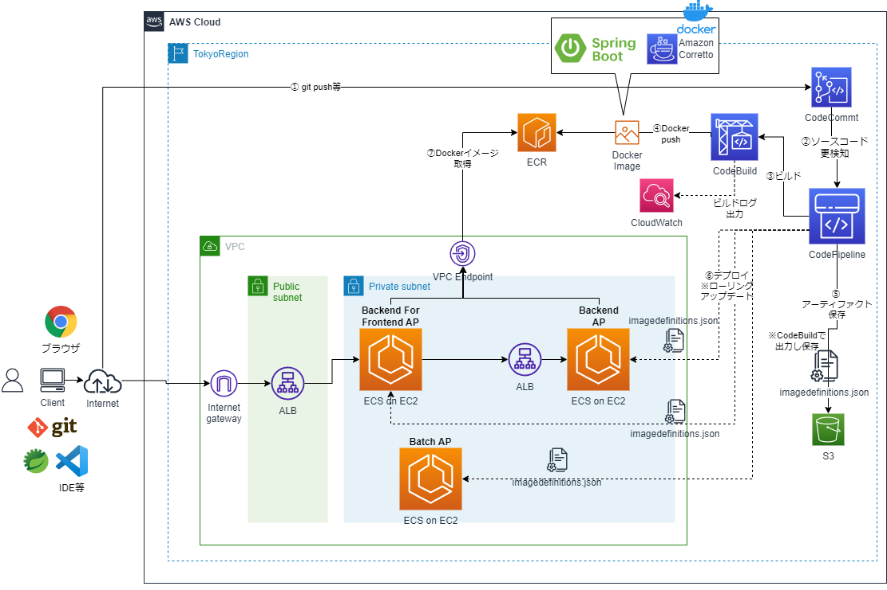

# SpringBoot APをECS on EC2で動作させCode系でCI/CDするCloudFormationサンプルテンプレート

## 構成
* CDは標準のローリングアップデートとBlueGreenデプロイメントの両方に対応している。
  * システム構成図　ローリングアップデート版

  * システム構成図　BlueGreenデプロメント版


* ログの転送は現状、awslogsドライバを使ったCloudWatch Logsへの転送に対応している。
  * TODO: いずれFireLensに対応したサンプルも追加したいです


* オートスケーリングは、平均CPU使用率のターゲット追跡スケーリングポリシーによる例に対応している。


## CI環境
* 別途、以下の2つのSpringBootAPのプロジェクトが以下のリポジトリ名でCodeCommitにある前提
  * backend-for-frontend
    * BFFのAP
  * backend
    * BackendのAP

### 1. ECRの作成
```sh
aws cloudformation validate-template --template-body file://cfn-ecr.yaml
aws cloudformation create-stack --stack-name ECR-Stack --template-body file://cfn-ecr.yaml
```
### 2. CodeBuildのプロジェクト作成
```sh
aws cloudformation validate-template --template-body file://cfn-bff-codebuild.yaml
aws cloudformation create-stack --stack-name BFF-CodeBuild-Stack --template-body file://cfn-bff-codebuild.yaml --capabilities CAPABILITY_IAM
aws cloudformation validate-template --template-body file://cfn-backend-codebuild.yaml
aws cloudformation create-stack --stack-name Backend-CodeBuild-Stack --template-body file://cfn-backend-codebuild.yaml --capabilities CAPABILITY_IAM
```
* Artifact用のS3バケット名を変えるには、それぞれのcfnスタック作成時のコマンドでパラメータを指定する
    * 「--parameters ParameterKey=ArtifactS3BucketName,ParameterValue=(バケット名)」

* 本当は、CloudFormationテンプレートのCodeBuildのSorceTypeをCodePipelineにするが、いったんDockerイメージ作成して動作確認したいので、今はCodeCommitになっている。動いてはいるので保留。

### 3. ECRへ最初のDockerイメージをプッシュ
2つのCodeBuildプロジェクトが作成されるので、それぞれビルド実行し、ECRにDockerイメージをプッシュさせる

## ECS環境
### 1. VPCおよびサブネット、InternetGateway等の作成
```sh
aws cloudformation validate-template --template-body file://cfn-vpc.yaml
aws cloudformation create-stack --stack-name ECS-VPC-Stack --template-body file://cfn-vpc.yaml
```

### 2. NAT Gatewayの作成とプライベートサブネットのルートテーブル更新
```sh
aws cloudformation validate-template --template-body file://cfn-ngw.yaml
aws cloudformation create-stack --stack-name ECS-NATGW-Stack --template-body file://cfn-ngw.yaml
```

### 3. Security Groupの作成
```sh
aws cloudformation validate-template --template-body file://cfn-sg.yaml
aws cloudformation create-stack --stack-name ECS-SG-Stack --template-body file://cfn-sg.yaml
```
* 必要に応じて、端末の接続元IPアドレス等のパラメータを指定
    * 「--parameters ParameterKey=TerminalCidrIP,ParameterValue=X.X.X.X/X」

### 4. VPC Endpointの作成
```sh
aws cloudformation validate-template --template-body file://cfn-vpe.yaml
aws cloudformation create-stack --stack-name ECS-VPE-Stack --template-body file://cfn-vpe.yaml
```
### 5. IAMの作成
```sh
aws cloudformation validate-template --template-body file://cfn-iam.yaml
aws cloudformation create-stack --stack-name ECS-IAM-Stack --template-body file://cfn-iam.yaml --capabilities CAPABILITY_IAM
```

### 6. ALBの作成
* ALB
```sh
aws cloudformation validate-template --template-body file://cfn-alb.yaml
aws cloudformation create-stack --stack-name ECS-ALB-Stack --template-body file://cfn-alb.yaml
```
* BlueGreenデプロイメントの場合のみ以下実行し、2つ目（Green環境）用のTarget Groupを作成
```sh
aws cloudformation validate-template --template-body file://cfn-tg-bg.yaml
aws cloudformation create-stack --stack-name ECS-TG-BG-Stack --template-body file://cfn-tg-bg.yaml
```

* ~~手順削除：ListenerRuleを使ったTargetGroupの設定~~
~~aws cloudformation validate-template --template-body file://cfn-tg.yaml~~
~~aws cloudformation create-stack --stack-name ECS-TG-Stack --template-body file://cfn-tg.yaml~~

### 7. ECSクラスタの作成
```sh
aws cloudformation validate-template --template-body file://cfn-ecs-cluster.yaml
aws cloudformation create-stack --stack-name ECS-CLUSTER-Stack --template-body file://cfn-ecs-cluster.yaml
```
* 必要に応じてキーペア名のパラメータ値を修正して使用
  * 「Mappings:」の「FrontendClusterDefinitionMap:」の「KeyPairName:」
  * 「Mappings:」の「BackendClusterDefinitionMap:」の「KeyPairName:」  
    * 「myKeyPair」となっているところを自分のキーペア名に修正
### 8. ECSタスク定義の作成
* タスク定義
```sh
aws cloudformation validate-template --template-body file://cfn-ecs-task.yaml
aws cloudformation create-stack --stack-name ECS-TASK-Stack --template-body file://cfn-ecs-task.yaml
```

* タスクへのIAMロールの付与
  * TBD: RDS,DynamoDBへのアクセスの必要に応じて
    * cfn-iamの.yamlの修正が必要

### 9-1. ECSサービスの実行（ローリングアップデートの場合）
* ローリングアップデートの場合は以下を実行
```sh
aws cloudformation validate-template --template-body file://cfn-ecs-service.yaml
aws cloudformation create-stack --stack-name ECS-SERVICE-Stack --template-body file://cfn-ecs-service.yaml
```
* 以下のパラメータを0にするとMinimumHealthyPercentを0%になるので、1,2分気持ちローリングアップデートの時間が短くなる
  * 「--parameters ParameterKey=RollingUpdateMinimumHealthyPercent,ParameterValue=0」
### 9-2. ECSサービスの実行（BlueGreenデプロイメントの場合）
* BlueGreenデプロイメントの場合は以下のパラメータを指定して起動
```sh
aws cloudformation validate-template --template-body file://cfn-ecs-service.yaml
aws cloudformation create-stack --stack-name ECS-SERVICE-Stack --template-body file://cfn-ecs-service.yaml --parameters ParameterKey=DeployType,ParameterValue=CODE_DEPLOY
```


### 10. APの実行確認
* Backendアプリケーションの確認  
  * VPCのパブリックサブネット上にBationのEC2を起動
```sh
aws cloudformation validate-template --template-body file://cfn-bastion-ec2.yaml
aws cloudformation create-stack --stack-name Demo-Bastion-Stack --template-body file://cfn-bastion-ec2.yaml
```
  * 必要に応じてキーペア名等のパラメータを指定
    * 「--parameters ParameterKey=KeyPairName,ParameterValue=myKeyPair」
  * BastionのEC2のアドレスは、CloudFormationの「ECS-Bastion-Stack」スタックの出力「BastionDNSName」のURLを参照    
  * EC2にSSHでログインし、以下のコマンドを「curl http://(Private ALBのDNS名)/backend/api/v1/users」を入力するとバックエンドサービスAPのJSONレスポンスが返却
    * CloudFormationの「ECS-SERVICE-Stack」スタックの出力「BackendServiceURI」のURLを参照

* BFFアプリケーションの確認
  * ブラウザで「http://(Public ALBのDNS名)/backend-for-frontend/index.html」を入力しフロントエンドAPの画面が表示される
    * CloudFormationの「ECS-SERVICE-Stack」スタックの出力「FrontendWebAppServiceURI」のURLを参照

* うまく動作しない場合、Cloud Watch Logの以下のロググループのAPログにエラーが出ていないか確認するとよい
  * /ecs/logs/Demo-backend-ecs-group
  * /ecs/logs/Demo-bff-ecs-group

### 11. Application AutoScalingの設定
* 以下のコマンドで、ターゲット追跡スケーリングポリシーでオートスケーリング設定
```sh
aws cloudformation validate-template --template-body file://cfn-ecs-autoscaling.yaml
aws cloudformation create-stack --stack-name ECS-AutoScaling-Stack --template-body file://cfn-ecs-autoscaling.yaml  --capabilities CAPABILITY_IAM
```
* BastionのEC2から、ApacheBench (ab) ユーティリティを使用して、ロードバランサーに短期間に大量のHTTPリクエストを送信
  * abコマンドのインストール
```sh
sudo yum install httpd-tools
```
  * 以下のいずれかのabコマンドを実行
```sh
ab -n 1000000 -c 1000 http://(Private ALBのDNS名)/backend/api/v1/users
```
```sh
ab -n 1000000 -c 1000 http://(Public ALBのDNS名).ap-northeast-1.elb.
amazonaws.com/backend-for-frontend/index.html
```
* 対象のECSサービスに関するCPU使用率に関するCloudWatchアラームが出ていることを確認
* 対象のECSサービスがスケールアウトされ、1タスク追加され2タスクになっていることを確認
* abコマンドが終了し、しばらくたつと、対象のECSサービスがスケールインされ、1タスクに戻っていることを確認
## CD環境（標準のローリングアップデートの場合）
* ローリングアップデートの場合は、以下のコマンドを実行
### 1. ローリングアップデート対応のCodePipelineの作成
```sh
aws cloudformation validate-template --template-body file://cfn-bff-codepipeline.yaml
aws cloudformation create-stack --stack-name Bff-CodePipeline-Stack --template-body file://cfn-bff-codepipeline.yaml --capabilities CAPABILITY_IAM

aws cloudformation validate-template --template-body file://cfn-backend-codepipeline.yaml
aws cloudformation create-stack --stack-name Backend-CodePipeline-Stack --template-body file://cfn-backend-codepipeline.yaml --capabilities CAPABILITY_IAM
```
* Artifact用のS3バケット名を変えるには、それぞれのcfnスタック作成時のコマンドでパラメータを指定する
    * 「--parameters ParameterKey=ArtifactS3BucketName,ParameterValue=(バケット名)」
### 2. CodePipelineの確認
  * CodePipelineの作成後、パイプラインが自動実行されるので、デプロイ成功することを確認する
### 3. ソースコードの変更
  * 何らかのソースコードの変更を加えて、CodeCommitにプッシュする
  * CodePipelineのパイプラインが実行され、新しいAPがデプロイされることを確認する

## CD環境（標準のBlueGreenデプロイメントの場合）
* BlueGreenデプロイメントの場合は、以下のコマンドを実行
### 1. CodeDeployの作成
```sh
aws cloudformation validate-template --template-body file://cfn-bff-codedeploy.yaml
aws cloudformation create-stack --stack-name Bff-CodeDeploy-Stack --template-body file://cfn-bff-codedeploy.yaml --capabilities CAPABILITY_IAM

aws cloudformation validate-template --template-body file://cfn-backend-codedeploy.yaml
aws cloudformation create-stack --stack-name Backend-CodeDeploy-Stack --template-body file://cfn-backend-codedeploy.yaml --capabilities CAPABILITY_IAM
```
* Artifact用のS3バケット名を変えるには、それぞれのcfnスタック作成時のコマンドでパラメータを指定する
    * 「--parameters ParameterKey=ArtifactS3BucketName,ParameterValue=(バケット名)」  
### 2. BlueGreenデプロイメント対応のCodePipelineの作成
```sh
aws cloudformation validate-template --template-body file://cfn-bff-codepipeline-bg.yaml
aws cloudformation create-stack --stack-name Bff-CodePipeline-BG-Stack --template-body file://cfn-bff-codepipeline-bg.yaml --capabilities CAPABILITY_IAM

aws cloudformation validate-template --template-body file://cfn-backend-codepipeline-bg.yaml
aws cloudformation create-stack --stack-name Backend-CodePipeline-BG-Stack --template-body file://cfn-backend-codepipeline-bg.yaml --capabilities CAPABILITY_IAM
```
* Artifact用のS3バケット名を変えるには、それぞれのcfnスタック作成時のコマンドでパラメータを指定する
    * 「--parameters ParameterKey=ArtifactS3BucketName,ParameterValue=(バケット名)」
### 3. CodePipelineの確認
  * CodePipelineの作成後、パイプラインが自動実行されるので、デプロイ成功することを確認する
### 4. ソースコードの変更
  * 何らかのソースコードの変更を加えて、CodeCommitにプッシュする
  * CodePipelineのパイプラインが実行され、新しいAPがデプロイされることを確認する


## （参考）CloudFormationコマンド文法メモ
* スタックの新規作成
```sh
aws cloudformation create-stack --stack-name myteststack --template-body file://cfn-ec2.yaml
```
* スタックの新規作成(削除保護設定あり)
```sh
aws cloudformation create-stack --stack-name myteststack --enable-termination-protection --template-body file://cfn-ec2.yaml
```
* スタックの更新
```sh
aws cloudformation update-stack --stack-name myteststack --template-body file://cfn-vpc.yaml
```
* テンプレートの検証
```sh
aws cloudformation validate-template --template-body file://cfn-vpc.yaml
```
* スタックの削除保護設定解除
```sh
aws cloudformation update-termination-protection --stack-name myteststack --no-enable-termination-protection
```
* スタックの削除
```sh
aws cloudformation delete-stack --stack-name myteststack
```
* IAMロールのスタックの場合 --capabilities CAPABILITY_IAM（またはCAPABILITY_NAMED_IAM）つける
```sh
aws cloudformation create-stack --stack-name my-iamgroup-stack --template-body file://cfn-iamgroup.yaml --capabilities CAPABILITY_IAM
```
